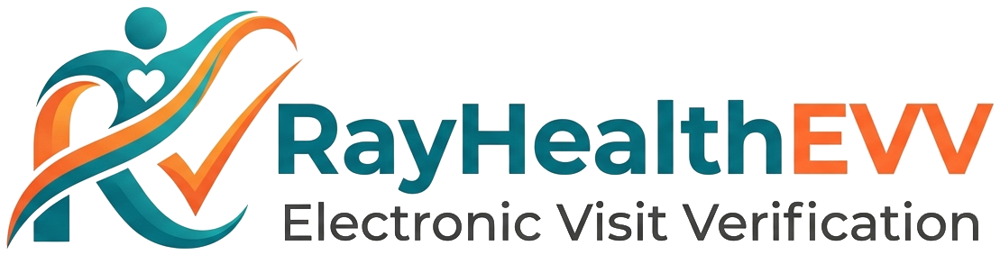

<div align="center">



<h3>Electronic Visit Verification for home-care agencies</h3>

<p>GPS-verified mobile clock-in &middot; scheduling &amp; compliance &middot; billing &amp; claims &middot; Medicaid aggregator submission</p>

<p>
  <a href="https://rayhealthevv.com"><strong>rayhealthevv.com&nbsp;&rarr;</strong></a>
</p>

<p>
  <a href="https://github.com/durga710/rayhealth-evv-platform/actions/workflows/ci.yml"></a>
  
  
  
  
  
  
</p>

</div>

---

RayHealthEVV is a **21st-Century Cures Act–aligned** Electronic Visit Verification platform for
home-care agencies. Caregivers clock in and out from a mobile app with GPS geofence verification;
agencies run scheduling, compliance, billing, and claims from a web console; and verified visits are
submitted to state Medicaid aggregators (**Sandata**, **HHAeXchange**) — all on an append-only,
audit-grade event log designed for HIPAA-grade privacy controls.

## Features

| | |
|---|---|
| 📍 **GPS-verified EVV** | Mobile clock-in/out with Haversine geofence anchoring against the client's service address. |
| 🗓️ **Scheduling & assignments** | Recurring schedules, conflict gating, and caregiver–client assignment with eligibility checks. |
| ✅ **Compliance engine** | Credential tracking, visit-maintenance exceptions, and a Go-Live readiness checklist. |
| 💵 **Billing & claims** | 837P claim generation, 835 remittance posting, denial scoring, and payroll export. |
| 🛰️ **Aggregator submission** | Real Sandata Alternate-EVV (async POST → poll). HHAeXchange mapping/configuration is present, but PA V5/SFTP transmission still requires vendor onboarding, payer code tables, validation, and issued credentials. |
| 🔒 **Audit defense** | Append-only `audit_events` enforced by a DB trigger, with a compliant retention sweep. |
| 🤖 **AI surfaces** | A caregiver support assistant and an agency workflow Copilot that emits typed, reviewable actions. |

## Monorepo

Turbo-managed npm workspaces:

| Workspace | Description |
|---|---|
| [`packages/core`](packages/core) | Domain entities (Zod-validated), repositories, migrations, the state-strategy registry (PA, NJ, …), and aggregator integration contracts. |
| [`packages/app`](packages/app) | Express REST API — auth, capability RBAC, audit middleware, billing, EVV export/submission, AI runtimes. |
| [`packages/web`](packages/web) | React + Vite admin console for agency owners and coordinators. |
| [`packages/mobile`](packages/mobile) | Expo (React Native) iOS/Android caregiver app, via Expo Router. |

## Quickstart

```bash
# 1. Install (postinstall runs patch-package)
npm install

# 2. Bring up local Postgres + set env
npm run docker:up
cp .env.example .env            # then edit DATABASE_URL / JWT_SECRET
export JWT_SECRET="$(openssl rand -hex 32)"

# 3. Migrate the schema
npm run db:migrate

# 4. Run the full quality gate (mirrors CI)
npm run check                   # typecheck · lint · security:scan · all workspace tests
```

> **Lockfile note:** regenerate `package-lock.json` only via the Docker-backed helper — a plain
> `npm install` on macOS strips Linux native bindings and breaks CI. See [`docs/LOCKFILE.md`](docs/LOCKFILE.md).

## Architecture

- **Web auth** — HttpOnly `rayhealth_session` cookie + CSRF token. No bearer tokens in browser storage; `scripts/security-surface-scan.ts` fails CI if a `localStorage` session pattern reappears.
- **Mobile auth** — JWT from `/auth/mobile/login`, stored in iOS Keychain / Android Keystore via `expo-secure-store`.
- **Server auth** — session cookie first, bearer fallback; every protected route is gated by `requireCapability(...)`.
- **Audit immutability** — `audit_events` is append-only via a mutation-blocking trigger; the retention sweep writes its own `audit_retention_runs` record inside a transaction.
- **Aggregator transmission** — per-agency config split across `agency_evv_config` (which aggregator), `agency_sandata_config`, and `agency_hhaexchange_config`; the state registry decides whether an agency may choose (PA: yes; NJ: forced HHAeXchange).

## Compliance posture

The architectural controls expected of a HIPAA Business Associate are in place — audit immutability,
encryption in transit, parameterized SQL, capability RBAC, auth-surface rate limiting, and secret-rotation
discipline. The **operational** HIPAA work (HIPAA-mode database, signed BAAs, risk analysis, penetration
test, cyber-liability insurance) is deferred until first real-agency onboarding. **Until those close, do
not onboard real PHI** — use the fixture caregiver for live validation. See [`docs/compliance/`](docs/compliance).

## Contributing

`main` is protected: no direct pushes, no force-pushes, linear history. Every PR must

1. pass the required CI checks (`typecheck`, `lint`, `security-scan`, `test-core`, `test-app`, `test-web`, `analyze`),
2. earn a Code Owner review ([`.github/CODEOWNERS`](.github/CODEOWNERS)),
3. use [Conventional Commits](https://www.conventionalcommits.org/) (`feat:`, `fix:`, `chore:`, …), and
4. resolve every review thread.

Shipping to production? Follow [`docs/RUNBOOK_DEPLOY.md`](docs/RUNBOOK_DEPLOY.md).

## Security

Please **do not** open public issues for vulnerabilities. Report via a
[private security advisory](https://github.com/durga710/rayhealth-evv-platform/security/advisories/new)
or email `durga@rayhealthevv.com` with the subject `[SECURITY]`. See [`SECURITY.md`](SECURITY.md).

## License

Proprietary — © 2026 RayHealth. All rights reserved. See [`LICENSE`](LICENSE).
