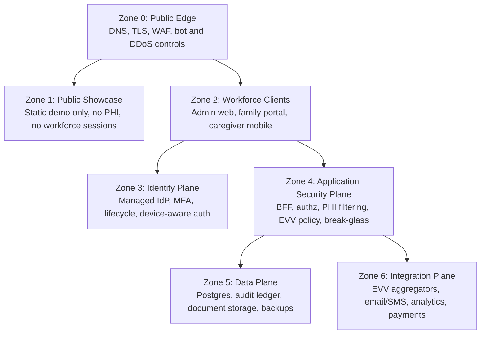

# RayHealth Security Architecture Design

**Goal:** Define a production-grade, HIPAA-aware security architecture for the RayHealth platform across the public showcase, admin web app, caregiver mobile app, API, data plane, and third-party integrations.

## Current-State Findings

The current codebase has the right product direction but a demo-grade security baseline in several critical places:

- The web app stores bearer JWTs in `localStorage` in [packages/web/src/lib/AuthContext.tsx](/Users/durgaghimeray/Desktop/rayhealthevv-fresh/rayhealth-fresh/packages/web/src/lib/AuthContext.tsx:1).
- The mobile app still uses a mock in-memory authentication context in [packages/mobile/src/lib/AuthContext.tsx](/Users/durgaghimeray/Desktop/rayhealthevv-fresh/rayhealth-fresh/packages/mobile/src/lib/AuthContext.tsx:1).
- API audit logging is only a console log stub in [packages/app/src/middleware/audit-log.ts](/Users/durgaghimeray/Desktop/rayhealthevv-fresh/rayhealth-fresh/packages/app/src/middleware/audit-log.ts:1).
- API authorization is role-capability based today, but it does not yet enforce minimum-necessary disclosure, break-glass justification, or relationship-aware PHI access.
- The public showcase and workforce product are close enough in structure that they need explicit trust-zone separation before production hardening continues.

This design treats those gaps as first-order architecture concerns rather than cleanup tasks.

## Design Principles

RayHealth should adopt a hybrid security model:

- Use managed services for identity, MFA, secret custody, key management, WAF, and edge protections.
- Keep authorization, tenant scoping, PHI filtering, EVV policy enforcement, consent logic, and audit semantics in RayHealth-owned application code.
- Treat the public showcase as a separate trust zone with zero PHI and zero shared workforce sessions.
- Favor minimum-necessary data access by surface, role, relationship, and workflow.
- Design for state-specific EVV evidence retention and correction workflows from day one.
- Prefer revocable, short-lived credentials over long-lived bearer secrets.

This split gives RayHealth strong commodity security controls without outsourcing domain-specific healthcare policy logic that vendors do not understand well enough.

## Trust Zones

### Zone 0: Public Edge

All inbound traffic passes through managed TLS termination, WAF, bot filtering, and rate limiting. Security headers, CSP, and request normalization are enforced here. No direct database or integration access is exposed from this layer.

### Zone 1: Public Showcase

The showcase is treated as a marketing/demo surface, not a lightweight variant of the production product. It uses sanitized demo data only, has no PHI, no shared cookies with workforce apps, and no access to production secrets. If the showcase embeds mobile simulation, it must do so with demo-only data sources and isolated session state.

### Zone 2: Workforce Clients

This zone includes the admin web app, family portal, and caregiver mobile app. These clients are untrusted execution environments. They may render data, but they do not become policy authorities. Web and mobile are intentionally handled differently because their threat models differ.

### Zone 3: Identity Plane

Identity is provided by a BAA-capable managed IdP. It handles login, MFA, password reset, session risk, SSO, and lifecycle events. Identity claims are inputs into RayHealth policy decisions, not the final authority on data access.

### Zone 4: Application Security Plane

This is the security heart of the platform. It owns session establishment for web, token validation for mobile, tenant scoping, authorization, consent checks, PHI redaction, EVV rule enforcement, break-glass workflows, and structured audit generation.

### Zone 5: Data Plane

The data plane contains Postgres, audit storage, document/object storage, encrypted backups, and key references. Access is allowed only through the application security plane or tightly scoped operational tooling.

### Zone 6: Integration Plane

Every external integration is isolated behind service accounts, scoped secrets, outbound validation, and audit. Integrations never inherit broad user privileges and never receive more data than the specific workflow requires.

## Identity, Session, and Access Model

### Admin Web and Family Portal

The web experience must move away from `localStorage` bearer JWTs. Instead, web authentication should use a backend-for-frontend session model:

1. The browser authenticates against the managed IdP with MFA as appropriate.
2. The IdP returns an authorization code to the RayHealth backend-for-frontend.
3. RayHealth exchanges that code server-side and establishes an application session.
4. The browser receives only `HttpOnly`, `Secure`, `SameSite` cookies.
5. The backend rotates refresh material and enforces idle and absolute timeouts.

This design reduces XSS token theft exposure and gives RayHealth a clean place to enforce step-up authentication for exports, staff administration, billing changes, or other high-risk actions.

### Caregiver Mobile App

The mobile app should use OIDC Authorization Code with PKCE. Tokens are stored only in device-backed secure storage. Access tokens are short-lived. Refresh tokens are rotated and individually revocable. If the device is lost or a caregiver is terminated, access can be revoked without waiting for password resets.

Offline EVV support is permitted, but only through a minimal encrypted queue that stores the active visit evidence needed for later submission. Offline storage must exclude unnecessary PHI and must bind queued data to the authenticated device/user context.

### Service and Integration Identity

All background jobs, EVV aggregator connectors, email/SMS senders, analytics exporters, and payment workflows must use dedicated service principals. They never reuse human user tokens. Credentials are scoped by integration and rotated independently.

## Authorization and PHI Policy Model

RayHealth should move from simple RBAC to policy-based authorization with layered evaluation:

1. **Identity claims:** user ID, role, tenant, MFA state, device context.
2. **Tenant scope:** agency boundary, enabled modules, state profile.
3. **Relationship checks:** caregiver-to-client, family-to-client, supervisor chain, assigned visit ownership.
4. **Consent and disclosure rules:** whether the workflow is authorized by treatment, operations, payment, legal basis, or explicit authorization.
5. **Minimum-necessary policy:** whether the exact fields requested should be shown, redacted, masked, or denied.
6. **Risk posture:** whether the action requires step-up MFA, break-glass justification, or supervisory review.

Possible policy outcomes are `allow`, `deny`, `allow-with-redaction`, `require-step-up-auth`, and `break-glass-temporary-access`.

This layer is where state-specific logic belongs. For example:

- EVV overrides must capture state-appropriate reason codes and link them to the original visit event.
- Texas-style maintenance or correction workflows need immutable linkage between the original event, correction request, approver, and final submission.
- Family access should be limited to the client records and visit context they are actually authorized to see.

## PHI and EVV Data Protection

RayHealth should classify data at ingest into at least these categories:

- Demo data
- Operational non-PHI data
- PHI / clinical or service-delivery data
- Credentials and secrets
- Audit-only evidence
- Integration credentials and payload history

Protection controls follow the data class:

- TLS for all network transport.
- Managed encryption at rest for database and object storage.
- Envelope encryption for especially sensitive exports, generated documents, and offline mobile caches.
- Short-lived signed URLs for downloads.
- Per-download audit for exports and generated documents.
- Data minimization by client surface so that family, caregiver, coordinator, and admin views do not all receive the same payload.

The showcase must never consume live PHI or production credentials. Documents containing PHI should be stored outside public web roots and accessed only through time-bounded, authorized retrieval flows.

## Audit Architecture

Audit is not an afterthought log stream. It is a compliance product surface.

Every meaningful security event should generate a structured audit record with:

- actor ID
- actor type (`user`, `service`, `system`)
- tenant/agency ID
- affected client or visit ID where applicable
- device or client application context
- action attempted
- outcome
- justification or reason code where applicable
- correlation/request ID
- before/after references for high-risk mutations
- timestamp from a trusted server clock

High-priority audited workflows include:

- login, logout, failed auth, MFA changes
- PHI record views and exports
- assignment changes affecting service delivery
- EVV clock edits, manual corrections, and overrides
- break-glass access requests and expirations
- integration credential changes
- document downloads containing PHI

The current console logger should be replaced with an immutable audit event pipeline backed by durable storage and queryable review tooling.

## Break-Glass and High-Risk Workflows

Break-glass access is allowed only for legitimate operational or safety scenarios and must not become a loophole. The workflow should require:

- explicit user justification
- narrow scope to the requested client/resource set
- short duration
- elevated audit detail
- automatic supervisory review
- alerting for repeated or suspicious use

High-risk actions such as bulk exports, credential changes, billing changes, and staff privilege escalation should require step-up authentication even for already logged-in admins.

## Integration Security

External integrations are common breach multipliers, so each connector must be isolated:

- One service account per integration and environment.
- Secrets stored in managed secret custody, not source control or client bundles.
- Webhooks verified with signatures and replay protection.
- Outbound payloads schema-validated before transmission.
- Retry queues isolated by connector so one failing vendor does not destabilize unrelated workflows.
- Audit events for each outbound submission, retry, correction, and failure.

For EVV aggregators specifically, submission history should preserve the original event, transformed payload, vendor response, correction path, and final status. That is essential for state audit readiness.

## Operational Security and Governance

The target operating model includes:

- quarterly access review by agency and role
- dependency and vulnerability scanning in CI
- secrets rotation on a schedule and on incident
- vendor BAA review and inventory
- incident response runbooks for lost device, credential theft, PHI over-disclosure, and integration breach
- tabletop exercises for security and operational leadership

This is the layer that turns good architecture into a sustainable compliance posture.

## Phased Rollout

### Phase 1: Harden the Current Stack

Deliver immediate risk reduction without large platform churn:

- Replace web `localStorage` bearer tokens with secure backend-managed sessions.
- Implement real mobile authentication with secure token storage and revocation.
- Replace console audit logs with structured durable audit events.
- Fully isolate showcase auth, cookies, and secrets from workforce systems.
- Enforce better session timeout, cookie policy, and rate limiting defaults.

### Phase 2: Add Policy and Monitoring Depth

Build the domain-aware controls:

- Centralize authorization and PHI redaction decisions.
- Introduce break-glass workflows and supervisory review.
- Add step-up authentication for exports and privilege changes.
- Move integration credentials and document encryption to dedicated secret and key management patterns.
- Add anomaly detection for suspicious PHI access and EVV correction behavior.

### Phase 3: Reach the Enterprise Target State

Expand into larger-agency and enterprise controls:

- SSO and SCIM provisioning
- formal retention engine by state/data class
- dedicated security analytics and alert triage
- stronger tenant isolation and protected analytics pipelines
- mature incident response and audit review tooling

## Explicit Non-Goals

This design does not assume:

- a custom in-house identity provider
- direct browser access to production bearer tokens
- shared auth state between the showcase and workforce applications
- reliance on vendor authorization products for healthcare-specific access rules
- permanent offline storage of broad PHI datasets on caregiver devices

## Recommended First Implementation Slice

The highest-value first slice is:

1. web session hardening
2. mobile real authentication
3. structured audit event model
4. authorization layer upgrade path
5. showcase isolation cleanup

That sequence closes the biggest current exposure gaps while creating the right seam for the deeper policy work that follows.
